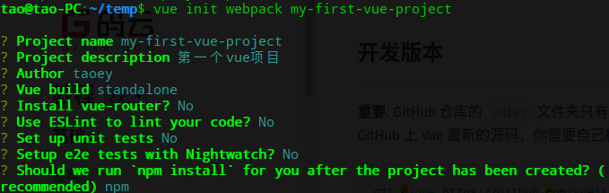
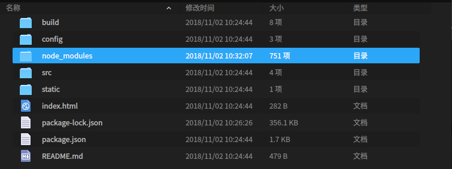
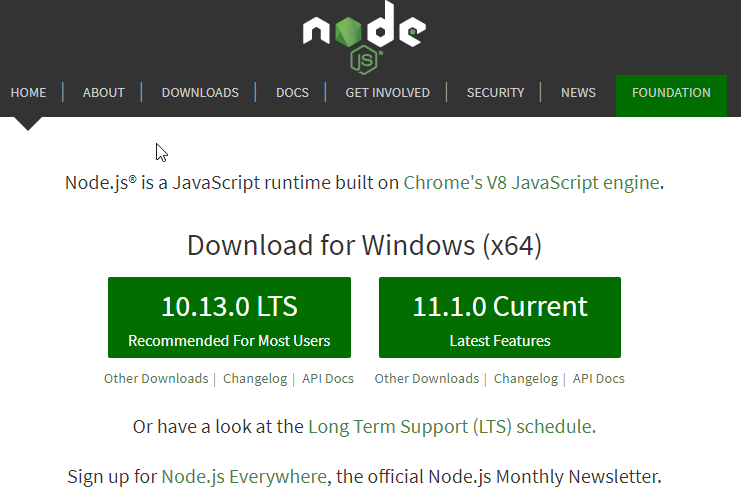
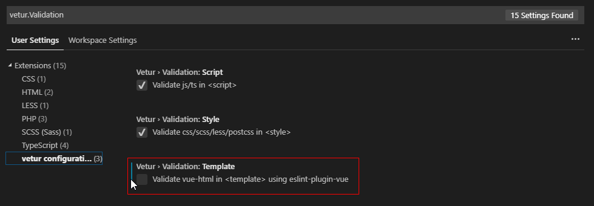
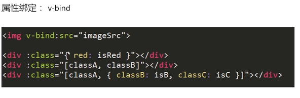
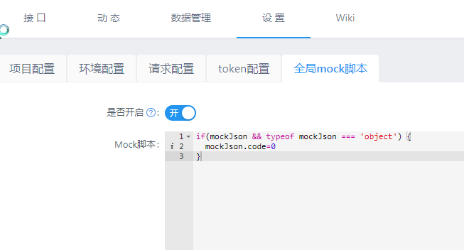
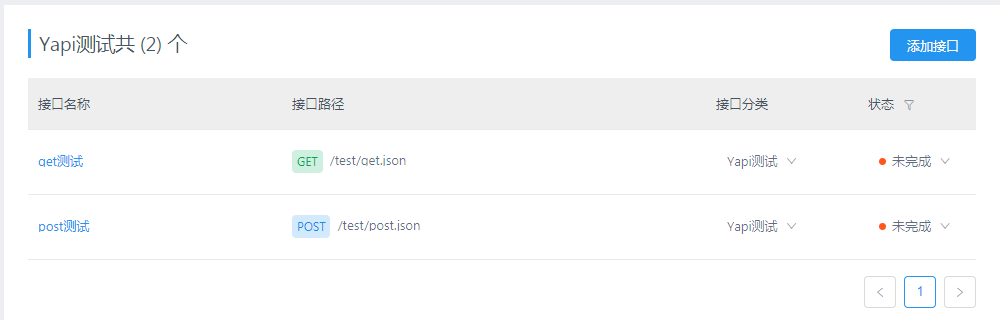
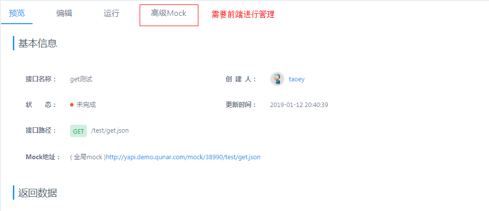
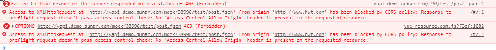
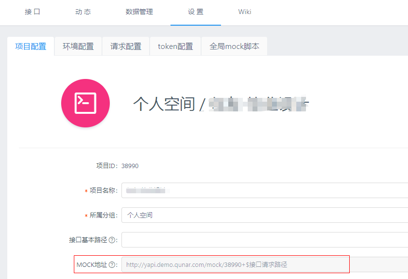

# Vue开发学习


## Linux下 npm 安装

```
sudo apt-get install npm
```

使用淘宝的npm镜像替换npm，提高下载速度

淘宝npm地址：http://npm.taobao.org/

cnpm的安装：

```
sudo npm install -g cnpm --registry=https://registry.npm.taobao.org
```

以后我们就可使用cnpm来替换npm使用了


全局安装vue-cli：

```
sudo cnpm install -g vue-cli
```

初始化第一个测试项目：

```
vue init webpack  项目名
```




一般来说到这一步之后，我们的项目基本搭建完成

项目的基本结构如下：



目录解析：

- package.json ：我们项目的一些基本配置
- src ：我们的主要战斗场所
- static ：存放一些静态资源
- node_modules ：我们项目依赖的模块的存放位置

在package.json所在目录下使用如下命令进行模块的安装

```
cnpm install
```

项目启动

```
npm run dev
```


### Windows下环境的配置

https://nodejs.org/en/



然后愉快的安装上,之后就和linux下的操作步骤一样了


## Vscode大杀器


vscode去除`Elements in iteration expect to have 'v-bind:key' directives`错误提示

问题描述:

> 在用vscode编写vue代码时，因为安装的有vetur插件，所以当代码中有v-for语法时，会提示，“Elements in iteration expect to have 'v-bind:key' directives.”这个错误
>
> 这是ESLint的功能，对vue进行了eslint检查。那么我们就把eslint对该插件的检查关闭

操作步骤:

 file->首选项->设置->搜索（vetur.Validation）或者直接`ctrl+,`打开设置界面

要设置为如下图所示的false未选中状态即可




## Vue相关模板指令

- v-text
- v-html
- {{}}
- v-if       没有dom对象
- v-show 有dom对象
- v-for
- v-on:click   -->  click
- v-blid:属性名
  - v-blid:src
  - v-blid:class  --> :class




一个Vue对象的重要的三部分：

- data：数据层
- methods：方法层
- watch：监听层

一个vue文件的三部分：

```html
<!--展示模块，放置我们的html元素-->
<template>
    <!--注意，所有的内容都需要一个根div包含，不然会出错-->
    <div>
        
    </div>
</template>
<!--脚本模块-->
<script>
export default {
    
}
</script>
<!--样式模块-->
<style scoped>

</style>

```

注意：

所有的

Vue事件

- v-on:click
- methods中添加一个方法

小demo:使用button改变input中的值


## vue 请求json数据到页面(vue-resource的使用)

参考文章   

- vue-resource使用:https://blog.csdn.net/thatway_wp/article/details/79005847
- vue-resource官方文档 https://github.com/pagekit/vue-resource/blob/develop/README.md
- [vue-resource插件使用](https://www.cnblogs.com/axl234/p/5899137.html)

安装

```
npm i vue-resource -S
```

引入

在main.js中添加下面两条:

```js
import VueResource from 'vue-resource'

Vue.use(VueResource)
```


get 方式测试：


```
            //向后台发送get数据
            getDataByGet(){                
                var url='http://www.hwt.com/api/studentInfo.json';
                this.$http.get(url)
                .then((respose)=>{
                    this.response_data = respose.data;
                    console.log(respose.data);
                })
                .catch(function(response){
                    alert("error");
                })
            },


```

post方法测试

```
            //向后台发送post数据
            getDataByPost(){
                var url = 'http://www.hwt.com/api/test/post_test.json';
                this.$http.post(url,this.formData)
                .then((response)=>{
                    console.log(response);
                    if(response.data.code=='200'){
                        this.response_data = response.data.result;
                        alert('成功');
                    }else{
                        alert('失败');
                    }
                
                })
                .catch(function(error){
                    console.log(error);
                })
            },
```


## vue请求数据--axios

**安装**

```
cnpm install axios
```

**引入**，在main.js 中添加下面两句

```
//引入axios
import axios from 'axios'
Vue.prototype.$http= axios
```

**使用**


## vue组件及生命周期函数


组件的使用：

- 引入组件

```js
import taoMain  from "./components/tao_main";
```

- 挂载组件

```js
export default {  
  name: 'App',
  components: {
    "tao-main":taoMain
  }
}
```

tao-main就可以作为一个新的标签在`<template></template>` 中进行使用了


生命周期函数

参考资料：

- [实例生命周期钩子](https://cn.vuejs.org/v2/guide/instance.html#%E5%AE%9E%E4%BE%8B%E7%94%9F%E5%91%BD%E5%91%A8%E6%9C%9F%E9%92%A9%E5%AD%90)
- [Vue2.0 探索之路——生命周期和钩子函数的一些理解](https://segmentfault.com/a/1190000008010666)

组件挂载，以及组件更新，组件销毁的时候触发的一系列方法，就叫做生命周期函数

```
mounted()
```


## 项目打包发布及相关问题

我们既然使用vue进行开发，我们必须要知道如何使我们的程序上线，不能只在本地跑一个服务。接下来我们研究如何进行vue项目的打包发布问题


## 前端数据接口管理配置

在进行前端开发时，我们如果采用的是前后端分离的开发模式，假设我们前端的开发进度比后端快，我们该如何写接口？调用请求？我最近发现了一个开源工具（Yapi）还不错，这里进行一下记录。

Yapi相关：

- 产品首页：https://yapi.ymfe.org/index.html
- 产品文档：https://yapi.ymfe.org/documents/index.html

那么我们如何合理的进行使用呢？

我采用的方式是：**nginx+全局domain+Yapi**模式进行开发

下面我详细讲一下这个步骤：

1、Yapi配置前端需要的接口，例如如下图，我配置了两个接口，一个get请求的接口，一个post请求的接口

配置接口之前，需要先配置这个选项，暂时我也不知道是怎么回事，先配置上，以后细看




```
if(mockJson && typeof mockJson === 'object') {
  mockJson.code=0
}
```






我们可以在高级Mock中配置我们需要的返回结果


get请求可以直接通过URL就可以访问，那post请求呢？我们知道在项目开发中，这样的请求会出现跨域问题（如下图），所以我们通过Nginx来解决这个问题



2、Nginx解决跨域问题

如果不在自己的内网中部署项目，项目没有那么保密的话，可以直接使用Yapi在线版的，至于要在Yapi官网注册登录即可。每一个注册的用户的**每一个项目**都会得到一个自己独特的URL，如下图：



我们只需要把下面的地址进行一下转发即可，其实官网已经给出了响应的配置

https://yapi.ymfe.org/documents/mock.html

这里说一下我自己的配置，当然也和官网相差无几

```
	server {
        listen       80;
        server_name  www.hwt.com;
		
		#前端项目
		location / {
            #proxy_set_header Host $host:$server_port;
            proxy_pass http://127.0.0.1:8101;			
        }
		
		#后端实际项目
		location /api {
			rewrite  ^/api/(.*)$ /$1 break;
			proxy_pass   http://localhost:8100;
		}
		#Yapi测试环境
		location /testapi/ {
			rewrite  ^/api/(.*)$ /$1 break;
			proxy_pass   http://yapi.demo.qunar.com/mock/38990;
		}
		
    }
```

Nginx配置到此结束，解决了跨域问题

3、vue设置全局domain

这里我是利用vue进行开发的，其他开发环境如何设置项目全局变量暂且不谈，今天单说**Vue如何配置全局变量**


npm相关命令

强制修复受损的包

```
npm audit fix --force
```


## Vue路由开发（页面之间跳转的实现）

​	

路由开发基本逻辑：

- 将组件映射到路由
- 告诉路由在哪里进行渲染


**路由嵌套**

```js
const router = new VueRouter({
  routes: [
    { path: '/user/:id', component: User,
      children: [
        {
          // 当 /user/:id/profile 匹配成功，
          // UserProfile 会被渲染在 User 的 <router-view> 中
          path: 'profile',
          component: UserProfile
        },
        {
          // 当 /user/:id/posts 匹配成功
          // UserPosts 会被渲染在 User 的 <router-view> 中
          path: 'posts',
          component: UserPosts
        }
      ]
    }
  ]
})
```


## vuex（状态的存储）

在vue的开发中我们需要保存用户的登录状态，但是在开发过程中我们会发现，如果我们F5进行刷新之后，我们的状态消失了，我们不得不再次进行登录。这肯定是不行的啊，所以我们采用vuex进行管理

参考资料：

-  [vue.js的状态管理vuex中store的使用](https://blog.csdn.net/zeternityyt/article/details/80041526)
-  [vue页面控制权限,vuex刷新保存状态、登录状态保存](https://segmentfault.com/a/1190000016047911)
-  [vuex官方文档](https://vuex.vuejs.org/zh/)
-  [vue store之状态管理模式](https://blog.csdn.net/qq_38658567/article/details/82847758)
-  [vuex的简单使用](https://segmentfault.com/a/1190000011914191)


**安装**

```
npm install vuex --save
```


2.0的action用dispatch触发，mutation用commit


**相关**

```
this.$store.commit('toShowLoginDialog', true);
this.$store.dispatch('toShowLoginDialog',false)
```


主要区别是：

dispatch：含有异步操作，例如向后台提交数据，写法： this.$store.dispatch('mutations方法名',值)

commit：同步操作，写法：this.$store.commit('mutations方法名',值)


**详细介绍**

主要分为四部分：

- state （声明一个值）
- getters（获取一个值）
- mutations（设置一个值）
- actions（和api交互）


我的一个完整的store.js

```js
import Vue from 'vue';
import Vuex from 'vuex';
import { type } from 'os';
import { stat } from 'fs';

Vue.use(Vuex);
let store = new Vuex.Store({
    // 1. state
    state:{
        user:localStorage.getItem("userInfo") || {},
        isLogin:localStorage.getItem('isLogin') || false,

        //header中的句集类型
        set_type:1
    },

    // // 2. getters
    getters:{
        getUser(state){
            return state.user;
        },
        getLogin(state){
            return state.isLogin;
        },
        getSetType(state){
            return state.set_type
        }
    },
    // 3. actions
    // 通常跟api接口打交道
    actions:{
        setUser({commit,state}, data){
            console.log("action:");
            console.log(data)
            commit("SET_USER", data);
        },
        setLogin({commit,state}, data){
            commit("SET_LOGIN",data)
        },
        
        setSetType({commit,state}, data){
            commit("SET_SET_TYPE",data)
        }

    },
    // 4. mutations
    mutations:{
        SET_USER(state,data){
            console.log("mutations-SET_USER:");
            console.log(state)
            console.log(data)
            localStorage.setItem('userInfo', JSON.stringify(data));
            state.user=data;
        },
        SET_LOGIN(state,data){
            console.log("登录状态设置")
            localStorage.setItem('isLogin', data);
            console.log(state.isLogin)
            state.isLogin = data
            console.log(state.isLogin)
        },
        SET_SET_TYPE(state,data){
            state.set_type = data 
        }
    }
});

export default store;
```


## vue组件之间传值

> 使用情况：组件还没有被当前页面加载，但是需要把值传入该组件中

> keys:父子传值，组件传值

以前在没有使用vue之前，我感觉这个先可以不学，在遇到如下需求时我不能解决了：

登录在header组件中，需要登录之后才能显示的内容在其他组件中。但是我们在登录之后只能改变header中的`isLogin`状态，改变不了其他组件中的状态。所以才能凸显这个问题还是比较重要的。

参考资料：

- [Vue2.0的三种常用传值方式、父传子、子传父、非父子组件传值](https://blog.csdn.net/lander_xiong/article/details/79018737)
- [vue -- 非父子组件传值，事件总线（eventbus）的使用方式](https://blog.csdn.net/wxl1555/article/details/84646832)
- [vue 父组件触发子组件methods中的方法？](https://www.zhihu.com/question/57800264)


**父向子传值实战**

- 子组件中

  在`export default`中添加`props`，其和method等同级，例如

  ```js
      props:{
        sentence:Object,  
      },
  ```

  `sentence` 是变量名，`object`是参数类型，可以接收json类型的数据，当然也可以使用String来接收String类型的数据，然后，我们就可以像使用data域中的数据那样使用这个变量了。

- 父组件中

  在引入的子组件中添加`:sentence="data"`，data是需要传入的数据

是不是很简单，哈哈哈

**子向父传值**

步骤：

- 子组件中

  在触发函数上写`this.$emit('childByValue',data)`，第一个参数是监听值，可以自定义成其他的值，但是需要父子统一，第二个data是需要传递的数据。

- 父组件中

  在引入的子组件标签上添加 `v-on:childByValue="solveChildDataMethod"`,其中`solveChildDataMethod`是一个用来处理子组件中数据的普通方法，其**回调返回的即是子组件中的数据**，我们可以在这个方法中把子组件传来的值赋值给父组件。

  

**非父子之间的传值**

B组件向A组件中传值

```
//在mian.js中
Vue.prototype.bus = new Vue()  //这样我们就实现了全局的事件总线对象

//组件A中，监听事件，mounted中
    mounted:function(){
        //接受tab参数
        this.bus.$on('bus_active_tab',(data)=>{
            this.active_tab = data; //把传来的值赋给到该组件data（）中的值
        })
    },

//组件B中，触发事件
this.bus.$emit('bus_active_tab', data)  //data就是触发updata事件要带走的数据


```


## Vue 路由route传值

> 使用情况：组件还没有被当前页面加载，但是需要把值传入该组件中
>
> keys:路由传值

例如，可以在点击事件中编写如下代码：

```js
var data = {}
this.$router.push({name:'topath',params:data});
```


在对应的页面中使用如下代码接受参数：

```js
mounted:function(){
	this.data = this.$route.params
},  
```

这样我们就可以通过路由进行传值了


## 组件传值 + 路由传值


-- TODO

菜单栏 +  table bar 控制 


## vue中的@

@ 默认是src路径的一个别称，我们可以在webpack.base.conf.js这个文件中看到

```js
  resolve: {
    extensions: ['.js', '.vue', '.json'],
    alias: {
      'vue$': 'vue/dist/vue.esm.js',
      '@': resolve('src'),
    }
  },
```

使用时：

```
import routerTest from "@/view/router_test.vue"
```

对应的组件位置就是：

```
vue-router-demo/src/view/router_test.vue
```


## vue中数据的更新

**添加**


**删除**


**修改**

比较特殊，需要使用

```
this.$set(数组名称，下标，修改数据)
```

例如：

```
showList:{
    comment:[],
    edit:[],
},
```

```
this.$set(this.showList.edit,1,true)
```


## vue页面权限

参考资料

- [vue vuex vue-rouert后台项目——权限路由（超详细简单版）](https://www.cnblogs.com/weven/p/8143518.html)
- [【vue+axios】一个项目学会前端实现登录拦截](https://segmentfault.com/a/1190000008383094)


## vue项目中使用Echarts

参考资料

- [Vue系列——在vue项目中使用echarts](https://blog.csdn.net/mr_wuch/article/details/70225364)


1、安装依赖

```
npm install echarts -S
```

2、全局引入

```
// 引入echarts
import echarts from 'echarts'
Vue.prototype.$echarts = echarts 
```

3、使用


## vue实现直接关闭浏览器自动退出登录功能

使用sessionStore代替localStore


## Vue下背景图片的设置

```html
<template>
    <div :style="backimage" class="outdiv">
        something...
    </div>
</template>
```


```html
<script>
    export default {
        data () {
            return {
                //添加背景图片
                backimage: {
                    backgroundImage: "url(" + require("../../../static/login.jpg") + ")",
                    backgroundRepeat: "no-repeat",
                    backgroundSize: "100% 100%",
                },
                formItem: {
                    username: '',
                    password: '',
                }
            }
        },
    }
</script>
```


## iview中使用钩子函数

以上传组件（upload）为例

```html
<Upload action="/api/upload/set.json"
    :on-success="upload_success"
    :show-upload-list = 'false'
>
    <Button>上传句集</Button>
</Upload>
```
在methods中写这个方法，即使用了钩子函数

```js
        upload_success(response, file, fileList){
            console.log(response)
            if(response.code==200){
                this.$Message.success("上传成功")
            }else{
                this.$Message.error(response.result)
            }
        }
```


## iview日期控件 +Java后台处理

iview日期控件获得到的日期是这样的格式：`2019-04-03T16:00:00.000Z`

而我们在后台存储的是当前日期0点的时间戳，所以需要在java后台进行格式转化


## 日历插件  V-Calendar


### 安装

参考地址：<https://vcalendar.io/guide/#installation>

```bash
npm install v-calendar@next
```

### 配置

在main.js中添加如下代码

```js
import Vue from 'vue';  //如果原来有，则不必添加
import VCalendar from 'v-calendar';
// Use v-calendar & v-date-picker components
Vue.use(
    VCalendar, {componentPrefix: 'vc',} // Use <vc-calendar /> instead of <v-calendar />
);
```

### 测试使用

直接在页面中嵌入如下标签

```html
<vc-calendar />
```

显示效果如下图（当月日历），则证明配置成功


### 进阶使用

时间选择器：date-picker


## 开发相关问题及解决

**1、找不到编译指令？**

```
TypeError: Cannot destructure property `compile` of 'undefined' or 'null'.
    at addHooks (E:\projects\front-end\tao-vue\vue-router-demo\node_modules\webpack-dev-server\lib\Server.js:131:49)
    at new Server (E:\projects\front-end\tao-vue\vue-router-demo\node_modules\webpack-dev-server\lib\Server.js:144:5)
    at startDevServer (E:\projects\front-end\tao-vue\vue-router-demo\node_modules\webpack-dev-server\bin\webpack-dev-server.js:355:14)
    at processOptions (E:\projects\front-end\tao-vue\vue-router-demo\node_modules\webpack-dev-server\bin\webpack-dev-server.js:309:5)
    at process._tickCallback (internal/process/next_tick.js:68:7)
    at Function.Module.runMain (internal/modules/cjs/loader.js:744:11)
    at startup (internal/bootstrap/node.js:285:19)
    at bootstrapNodeJSCore (internal/bootstrap/node.js:739:3)
```

webpack-dev-server版本过高导致，执行如下命令

```
npm install -D webpack-dev-server@3.0.0
```


**2、无权限问题？找不到文件？**

```
npm WARN checkPermissions Missing write access to
```

删除本地node_modules文件夹，之后再次`npm install`即可恢复

